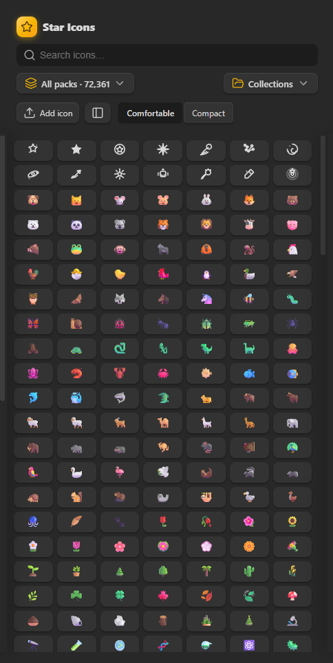
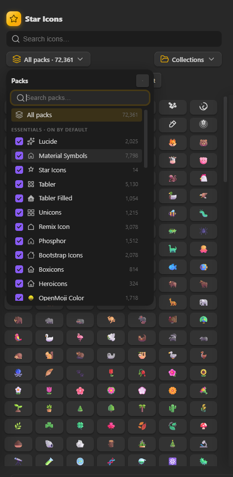
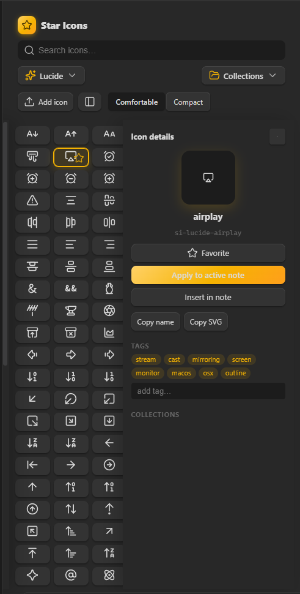
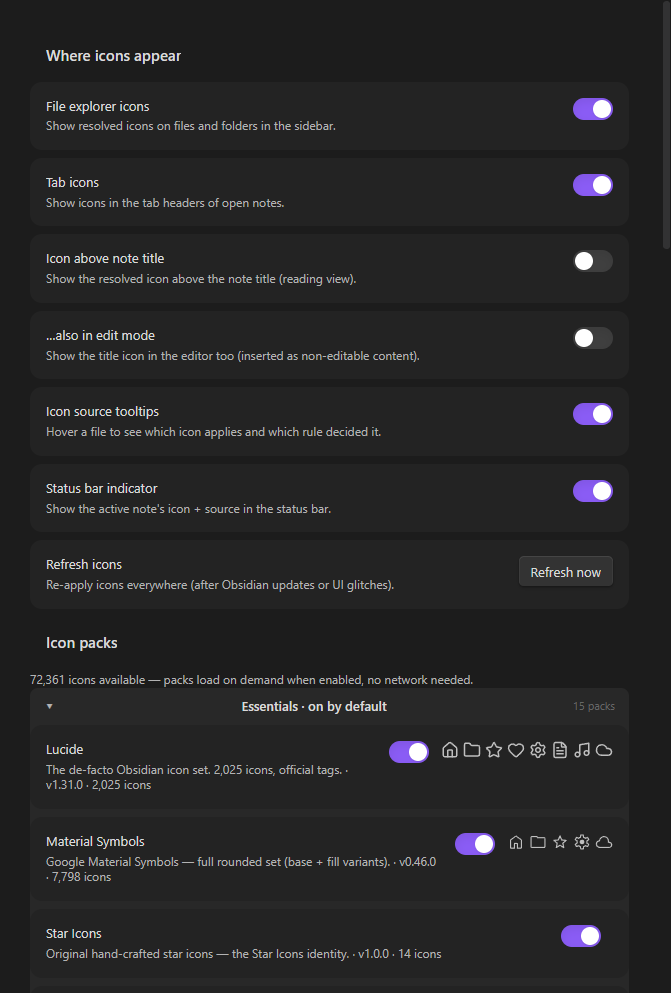
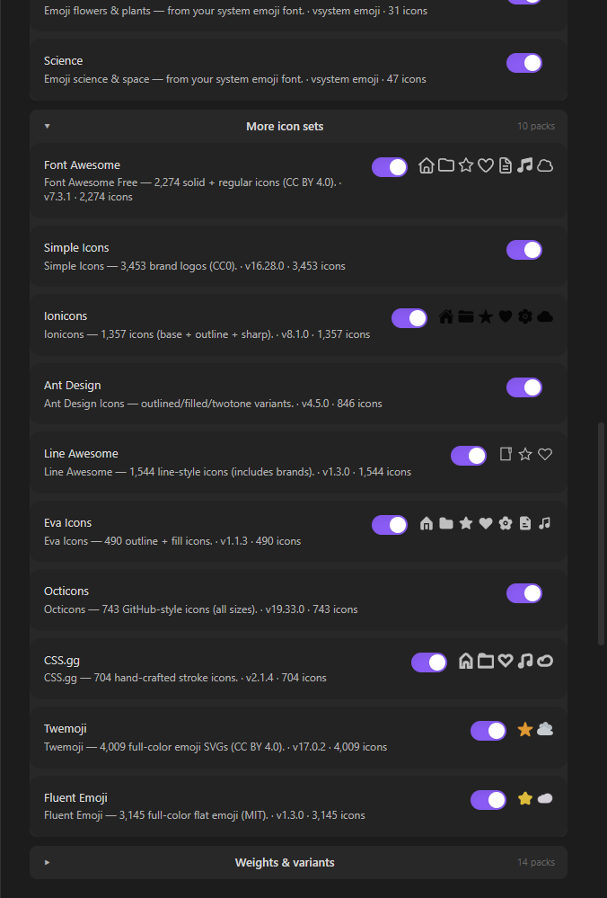

# ⭐ Star Icons

**The icon collection manager for Obsidian** — 72,000+ icons, organized into collections and tags, and applied to files, folders and tabs through an intuitive rules engine with live preview and full transparency.

Star Icons takes a third path in the icon-plugin landscape:

- **Iconize** gives you total manual control.
- **AutoIcons** gives you set-and-forget automation.
- **Star Icons** gives you a *library*: curate, tag and collect icons like music playlists, then apply them with rules that explain themselves.

  

---

## 📸 Screenshots

| | |
|---|---|
|  |  |
| **Icon Manager** — the collection hub | **Icon picker** — search & apply |

| | |
|---|---|
|  |  |
| **Icon details** — preview, tags, collections | **Settings** — packs, file types, data |



---

## ✨ Features

### 🗂️ Icon Collection Manager (the hub)
A dedicated sidebar view — *the* place to browse your icons.

- **72,361 icons, fully offline** — no network requests, ever. Packs ship as
  data files next to the plugin and load **on demand**: `main.js` stays ~120 KB,
  only the packs you enable are read, and every icon carries **style tags**
  (`outline`, `filled`, `bold`, `color`, `brand`…) so searching 72k icons never
  feels like 72k near-duplicates.
  - **Core — on by default (26,932 icons):** Material Symbols (7,798) ·
    Tabler (5,130) · Remix Icon (3,078) · Bootstrap (2,078) · Lucide (2,025) ·
    OpenMoji Color (1,718) · Phosphor (1,512) · Unicons (1,215) ·
    Tabler Filled (1,054) · Boxicons (814) · Heroicons (324) · Animals (94) ·
    Science (47) · Nature & Flowers (31) · Star Icons (14)
  - **Extended — opt-in in Settings (45,429 more):** Material Outlined (7,798) ·
    Material Sharp (7,798) · Twemoji 🎨 (4,009) · Simple Icons (3,453) ·
    Fluent Emoji 🎨 (3,145) · Phosphor Bold/Fill/Light/Thin/Duotone (7,560) ·
    Font Awesome (2,274) · OpenMoji Mono (1,860) · Ionicons (1,357) ·
    Line Awesome (1,544) · Ant Design (846) · Octicons (743) · CSS.gg (704) ·
    Boxicons Solid/Logos (820) · Eva (490) · Heroicons Solid (324) ·
    Unicons Solid/Mono/Thinline (704)
- Search with fuzzy matching across names, tags and styles
- Filter by pack, or by **your own tags**
- **Collections**: drag icons in, reorder with drag & drop, rename, delete
- **Favorites** and **recently used** strips in the picker
- Detail panel: big preview, tags editor, collection membership, copy name/SVG, *apply to the active note*

### 🎛️ Rules engine that explains itself
Rules run **top-to-bottom** and the first enabled match wins — but unlike other plugins, you always know *why* an icon is there.

- **Conditions**: file name · file path · extension · folder · tag · property · heading · **and the system clock** (day of week + time window)
- Match **all** or **any** conditions
- Actions: set an icon · random icon from a collection · use Obsidian's default
- **Live preview**: watch matching files appear as you build the rule
- **Drag & drop reordering**, enable/disable per rule
- **Icon source tooltips**: hover any file to see which icon applies and which rule decided it
- Status bar indicator shows the active note's icon + source

### 📐 Priority that's predictable

```
Manual override  >  Rules (in order)  >  File-type default  >  Global default
```

### 🖱️ Apply icons everywhere
- **File explorer**: files *and* folders
- **Tab headers** of open notes
- **Above the note title** (reading view, optionally edit mode)
- Right-click any file → *Set icon…* / *Copy icon name* / *Remove icon override*
- Command palette commands + a ribbon button
- Manual overrides, file-type defaults (`.md`, `.pdf`, …) and a global default

### 🧰 And more
- Pack on/off toggles (instantly shrinks search space)
- Export / import your whole configuration as JSON
- Settings reset, keyboard-navigable icon picker, dark/light theme aware
- Zero dependencies beyond the Obsidian API — bundled icons, bundled everything

---

## 🚀 Getting started

### From the community plugin store
1. Settings → Community plugins → Browse → search **"Star Icons"** → Install → Enable.

### Manual install (from source)
1. Download `main.js`, `manifest.json`, `styles.css` and the **`packs/` folder** from the latest release.
2. Copy them into `<vault>/.obsidian/plugins/star-icons/` (keep `packs/` as a subfolder).
3. Reload Obsidian and enable **Star Icons**.

### Development
```bash
npm install
npm run build:icons   # regenerate src/data/generated/*.json from node_modules packs
npm run dev           # watch mode (esbuild + packs/ copy)
npm run build         # production build -> main.js + packs/
npm test              # rule engine unit tests
```

---

## 📖 Rules deep-dive

| Condition | What it checks | Example |
| --- | --- | --- |
| File name | the note's basename | `contains "journal"` |
| File path | full vault-relative path | `starts with "Projects/"` |
| Extension | the file type | `is in "md, pdf, png"` |
| Folder | the parent folder | `is in "Daily Notes/2025"` |
| Tag | tags from frontmatter/inline | `equals "todo"` |
| Property | any frontmatter property | `status equals "active"` |
| Heading | headings inside the note | `starts with "Chapter"` |
| Time | day of week + 24h window | `Mon–Fri, 09:00–17:00` |

Rules are evaluated in order; the first **enabled** rule whose conditions match wins.
Drag rules to reorder, toggle them off without deleting, and use the live
preview to sanity-check before saving.

> 💡 Tip: combine a `folder` rule with a **random** action and a collection of
> 20 icons — every project folder gets its own rotating icon.

---

## 🧭 Philosophy

1. **Library first.** Icons are content. Tag them, collect them, curate them.
2. **Transparency.** Every icon on screen can explain its own provenance.
3. **Offline & fast.** No fetch, no CDN, no waiting.
4. **Native feel.** Icons follow Lucide's design guidelines (24×24, 2px stroke,
   round caps) so they sit naturally inside Obsidian.

---

## 📦 Icon packs

| Pack | Count | Style | Source |
| --- | --- | --- | --- |
| Material Symbols | 7,798 | rounded (base+fill) | [Google Fonts](https://fonts.google.com/icons) (Apache 2.0) |
| Material Outlined / Sharp | 15,596 | outlined / sharp | [Google Fonts](https://fonts.google.com/icons) (Apache 2.0) |
| Tabler / Tabler Filled | 6,184 | outline / filled | [tabler.io/icons](https://tabler.io/icons) (MIT) |
| Remix Icon | 3,078 | line + fill | [remixicon.com](https://remixicon.com) (Apache 2.0) |
| Twemoji | 4,009 | full-color emoji | [twemoji](https://twemoji.twitter.com) (CC BY 4.0) |
| Simple Icons | 3,453 | brand logos | [simpleicons.org](https://simpleicons.org) (CC0) |
| Fluent Emoji | 3,145 | full-color flat | [fluentui-emoji](https://github.com/microsoft/fluentui-emoji) (MIT) |
| Phosphor (×6 weights) | 9,072 | regular/bold/fill/light/thin/duotone | [phosphoricons.com](https://phosphoricons.com) (MIT) |
| Bootstrap Icons | 2,078 | filled | [icons.getbootstrap.com](https://icons.getbootstrap.com) (MIT) |
| Lucide | 2,025 | stroke | [lucide.dev](https://lucide.dev) (ISC) |
| OpenMoji Color / Mono | 3,578 | color / monochrome emoji | [openmoji.org](https://openmoji.org) (CC BY-SA 4.0) |
| Font Awesome Free | 2,274 | solid + regular | [fontawesome.com](https://fontawesome.com) (CC BY 4.0) |
| Unicons (×4 styles) | 1,919 | line/solid/mono/thinline | [iconscout.com/unicons](https://iconscout.com/unicons) (Apache 2.0) |
| Ionicons | 1,357 | base + outline + sharp | [ionicons.com](https://ionic.io/ionicons) (MIT) |
| Line Awesome | 1,544 | line (incl. brands) | [icons8.com/line-awesome](https://icons8.com/line-awesome) (MIT) |
| Ant Design | 846 | outlined/filled/twotone | [ant.design](https://ant.design/components/icon) (MIT) |
| Boxicons (×3 styles) | 1,634 | regular/solid/logos | [boxicons.com](https://boxicons.com) (MIT) |
| Octicons | 743 | filled | [primer.style/octicons](https://primer.style/octicons) (MIT) |
| CSS.gg | 704 | stroke | [css.gg](https://css.gg) (MIT) |
| Eva Icons | 490 | outline + fill | [akveo.github.io/eva-icons](https://akveo.github.io/eva-icons) (MIT) |
| Heroicons / Solid | 648 | outline / filled | [heroicons.com](https://heroicons.com) (MIT) |
| Animals / Science / Nature | 172 | system emoji | rendered with your OS emoji font |
| Star Icons | 14 | custom | original (MIT) |

### Licenses & trademarks
- **Attribution (CC BY):** Font Awesome Free and Twemoji require a credit line — provided above and in the plugin's About/README.
- **Share-alike (CC BY-SA):** OpenMoji SVGs are bundled unmodified.
- **Brands:** Simple Icons (CC0), Boxicons Logos, Line Awesome brands and Octicons contain third-party logos. Free to use; do not imply endorsement.

---

## 🤝 Contributing

- **Report bugs** & request features via [GitHub issues](https://github.com/Stef4678/star-icons/issues) — the plugin has a built-in *Report a bug* dialog (`Ctrl+P` → "Star Icons: Report a bug…") that copies a diagnostic report for you.
- **Add icons**: edit `src/data/packs/star.ts` (24×24 stroke-style SVGs) and open a PR.
- **Add packs**: extend `scripts/build-icon-data.mjs` and re-run `npm run build:icons`.

Star Icons is open source (MIT) — [star on GitHub](https://github.com/Stef4678/star-icons) and like the plugins it learns from
([Iconize](https://github.com/FlorianWoelki/obsidian-iconize),
[Iconic](https://github.com/ram02z/obsidian-iconic), [AutoIcons](https://github.com/NotPunchnox/obsidian-auto-icons)).

---

## 📜 License

MIT © 2026 Kerekes Stefan (Star Icons). Bundled icon packs retain their respective licenses (see above).
