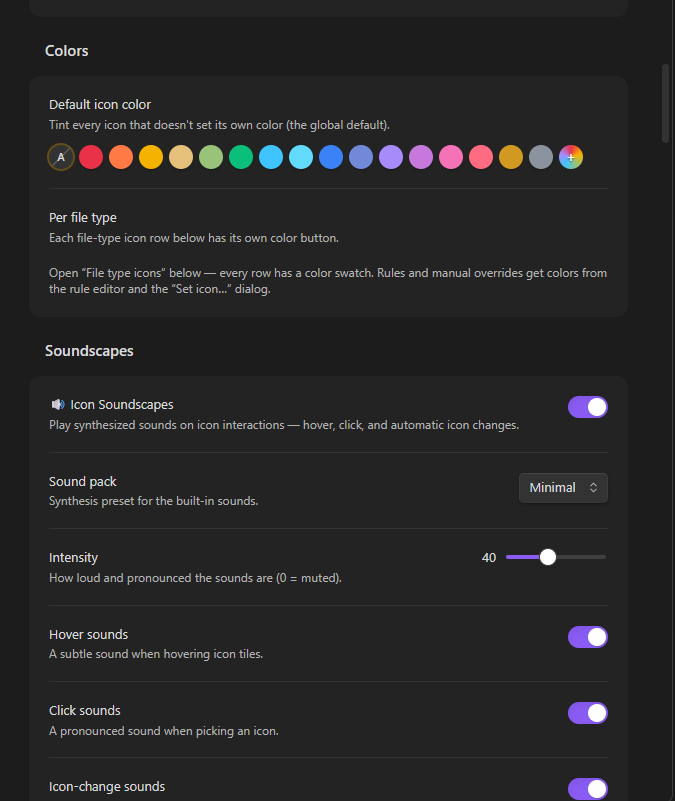
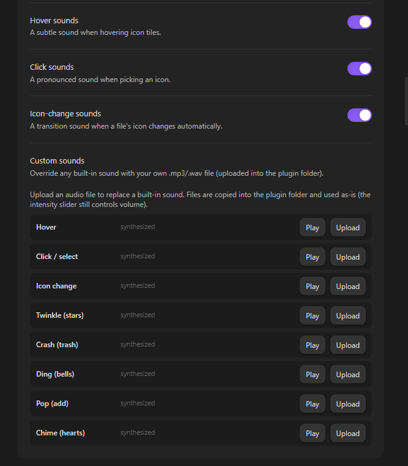
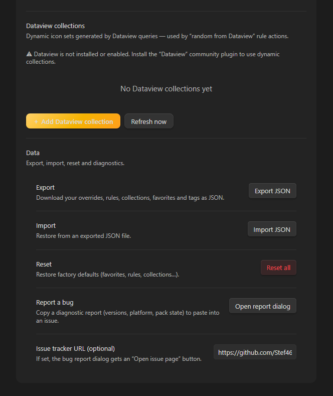
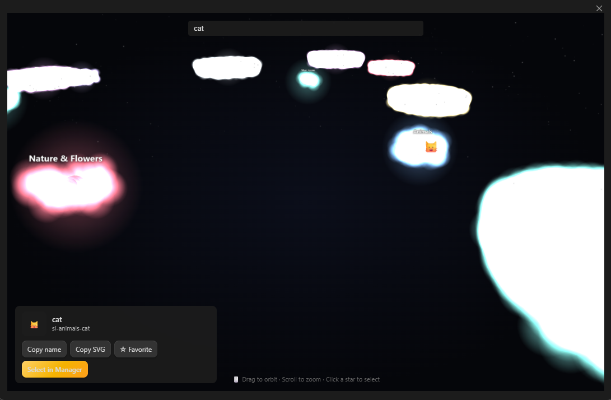

# ⭐ Star Icons

**The icon collection manager for Obsidian** — 160,000+ icons, organized into collections and tags, and applied to files, folders and tabs through an intuitive rules engine with live preview and full transparency.

Star Icons takes a third path in the icon-plugin landscape:

- **Iconize** gives you total manual control.
- **AutoIcons** gives you set-and-forget automation.
- **Star Icons** gives you a *library*: curate, tag and collect icons like music playlists, then apply them with rules that explain themselves.

  

> ⚠️ **Attribution & trademarks:** Star Icons bundles icon sets from many third
> parties — Font Awesome, Twemoji, OpenMoji, Simple Icons, brand logos and
> more. Every pack keeps its original license and any required credit line
> (details in [Licenses & trademarks](#licenses--trademarks) below), and
> third-party logos/names are trademarks of their respective owners — their
> inclusion here is not an endorsement.

---

## 📸 Screenshots

| | |
|---|---|
|  |  |
| **Icon Manager** — the collection hub | **Icon picker** — search & apply |

| | |
|---|---|
|  |  |
| **Icon details** — preview, tags, collections | **Settings** — packs, file types, data |


| | | |
|---|---|---|
|  |  |  |
| **Settings** — Colors | **Settings** — Dataview collections | **Settings** — Soundscapes |



**Icon Galaxy** — browse the whole library as an interactive 3D universe

---

## ✨ Features

### 🗂️ Icon Collection Manager (the hub)
A dedicated sidebar view — *the* place to browse your icons.

- **160,370 icons, offline after first load** — pack data ships with the repo
  and manual installs; when a pack file is missing (Obsidian's community
  installer only downloads `main.js`, `styles.css` and `manifest.json`) it is
  fetched once from a CDN and **cached locally**, so everything works offline
  afterwards. Packs load **on demand**: `main.js` stays small, only the packs
  you enable are read, and every icon carries **style tags**
  (`outline`, `filled`, `bold`, `color`, `brand`…) so searching 160k icons never
  feels like 160k near-duplicates.
  - **Core — on by default (26,932 icons):** Material Symbols (7,798) ·
    Tabler (5,130) · Remix Icon (3,078) · Bootstrap (2,078) · Lucide (2,025) ·
    OpenMoji Color (1,718) · Phosphor (1,512) · Unicons (1,215) ·
    Tabler Filled (1,054) · Boxicons (814) · Heroicons (324) · Animals (94) ·
    Science (47) · Nature & Flowers (31) · Star Icons (14)
  - **Extended — opt-in in Settings (133,438 more):** Material Outlined (7,798) ·
    Material Sharp (7,798) · **Fluent UI Icons (20,239)** · **Solar (8,425)** ·
    **MDI (7,638)** · **Hugeicons (6,005)** · Twemoji 🎨 (4,009) ·
    Simple Icons (3,453) · **MingCute (3,336)** · Fluent Emoji 🎨 (3,145) ·
    **Carbon (2,763)** · **Health Icons (2,709)** · **IconPark Outline (2,658)** ·
    **Myna UI (2,658)** · **TDesign (2,364)** · Font Awesome (2,274) ·
    **SVG Logos 🎨 (2,173)** · **IconPark Solid (1,970)** ·
    **IconPark TwoTone 🎨 (1,947)** · OpenMoji Mono (1,860) ·
    **EmojiOne 🎨 (1,834)** · **IconaMoon (1,781)** · **Fluent MDL2 (1,735)** ·
    **Iconoir (1,682)** · **VSCode Icons 🎨 (1,595)** · Line Awesome (1,544) ·
    Phosphor Bold/Fill/Light/Thin/Duotone (7,560) · Ionicons (1,357) ·
    **Pixelarticons (1,306)** · **Pepicons Pop (1,290)** ·
    **Pepicons Pencil (1,275)** · **Framework7 (1,253)** · **Teenyicons (1,200)** ·
    **Devicon 🎨 (1,058)** · **Majesticons (1,045)** · **Jam (940)** ·
    **File Icons (930)** · Ant Design (846) · **Gravity UI (799)** ·
    Octicons (743) · **Circle Flags 🎨 (718)** · **css.gg (704)** ·
    **Codicons (657)** · Boxicons Solid/Logos (820) · Eva (490) ·
    **Akar Icons (458)** · **Skill Icons 🎨 (400)** · **Radix Icons (342)** ·
    Heroicons Solid (324) · **Humbleicons (287)** · **Feather (286)** ·
    **EOS Icons (253)** · Unicons Solid/Mono/Thinline (704)
    🎨 = full-color pack (keeps its own colors; the tint palette does not apply)
- Search with fuzzy matching across names, tags and styles
- Filter by pack, or by **your own tags**
- **Collections**: drag icons in, reorder with drag & drop, rename, delete
- **Favorites** and **recently used** strips in the picker
- Detail panel: big preview, tags editor, collection membership, copy name/SVG, *apply to the active note*

### 🎛️ Rules engine that explains itself
Rules run **top-to-bottom** and the first enabled match wins — but unlike other plugins, you always know *why* an icon is there.

- **Conditions**: file name · file path · extension · folder · tag · property · heading · **and the system clock** (day of week + time window)
- Match **all** or **any** conditions
- Actions: set an icon · random icon from a collection · use Obsidian's default
- **Live preview**: watch matching files appear as you build the rule
- **Drag & drop reordering**, enable/disable per rule
- **Icon source tooltips**: hover any file to see which icon applies and which rule decided it
- Status bar indicator shows the active note's icon + source

### 📐 Priority that's predictable

```
Manual override  >  Rules (in order)  >  File-type default  >  Global default
```

### 🖱️ Apply icons everywhere
- **File explorer**: files *and* folders
- **Tab headers** of open notes
- **Above the note title** (reading view, optionally edit mode)
- Right-click any file → *Set icon…* / *Copy icon name* / *Remove icon override*
- Command palette commands + a ribbon button
- Manual overrides, file-type defaults (`.md`, `.pdf`, …) and a global default

### 🎨 Color palette
Applied icons can be tinted, not just reshaped: pick a color from the preset
palette (or any custom color) in **Settings → Colors**, per file type, per rule
(in the rule editor), per manual override (via *Set icon…* / *Set icon color…*),
and from the Icon Manager. The tint follows the same priority as the icon
itself (override > rules > file type > default) and recolors stroke/fill packs
(Lucide, Tabler, Material, …); full-color packs like OpenMoji/Twemoji and OS
emoji keep their own colors.

### 🌈 Icon Aurora
A subtle animated **nebula backdrop** that glows behind the Icon Manager grid
and the icon picker, gently shifting hue and tinted to the **active pack's
color** (auto-switches as you filter by pack). Respects `prefers-reduced-motion`.

### 📊 Dataview integration
Turn any Dataview query into a **dynamic icon collection**: in
**Settings → Dataview collections** write a DQL query whose rows carry icon ids
(`LIST icon FROM #project`, `TABLE icon FROM "notes"`, …) and pick the
frontmatter property that holds them. Rules can then use *Random from
Dataview* actions — each file gets a deterministic icon drawn from the query's
current results, refreshed automatically on vault changes (Dataview itself is
optional; rules fall through gracefully until it's installed). The Icon
Manager lists your Dataview collections and lets you browse their live
results. Combine with the color palette for fully dynamic, color-coded
explorers.

### 🔊 Icon Soundscapes
Every icon can *sound* like itself. Turn on **Soundscapes** in
Settings → Soundscapes and the Icon Manager / icon picker play short
Web-Audio sounds — a subtle blip on hover, the icon's own voice on click
(`star` → twinkle ✨, `trash` → crash 🗑️, `bell` → ding 🔔), and a transition
sound when a file's icon changes automatically (e.g. a rule starts matching).
Choose a synthesis pack (**8-bit**, **Cinematic**, **Minimal**), adjust the
intensity from subtle to pronounced, toggle hover/click/change sounds
individually, and override any sound with your own **.mp3/.wav** file
(Settings → Soundscapes → Custom sounds). Preview icons' sounds from the Icon
Manager's detail panel or its 🔊 toolbar button. Soundscapes default to off —
no unexpected audio until you enable it.

### 🌌 Icon Galaxy (3D)
Browse your whole icon library as an **interactive 3D universe**: every icon is
a glowing star orbiting its pack's planet along the galaxy's spiral arms
(stars are tinted by pack). Open it from the Icon Manager's **🌌 Galaxy**
button or the *Open Galaxy View (3D)* command:
- **Drag to orbit**, **scroll/pinch to zoom** (OrbitControls with damping)
- **Hover** a star for its name · **click** to select it (syncs to the
  Manager's detail panel; copy name/SVG, favorite, or jump back)
- **Search** — the camera *flies* to the matching star
- **Cinematic look**: UnrealBloom neon glow, glowing *constellation* lines that
  link icons sharing a collection or tag, a soft nebula haze, and a gentle
  **auto-orbit** that pauses while you drag
- Ambient starfield, additive glow sprites, pack-colored planets with labels,
  and a slow galaxy rotation. Rendered with the bundled
  [Three.js](https://threejs.org) engine; requires WebGL.

### 🧰 And more
- Pack on/off toggles (instantly shrinks search space)
- Export / import your whole configuration as JSON
- Settings reset, keyboard-navigable icon picker, dark/light theme aware
- No runtime dependencies beyond the Obsidian API and the bundled Three.js
  engine (MIT) used by the Galaxy View — the plugin itself ships standalone;
  the icon data comes from many third-party icon libraries (each with its own
  license, see [Licenses & trademarks](#licenses--trademarks)) and is bundled
  or fetched on demand and cached locally

### 🎨 Custom icons and SVG support
Star Icons allows users to import SVG files, paste SVG markup, define custom tags, copy icon names or SVG code, and organize personal icons in the “My Icons” pack. Imported SVGs are normalized to a 24×24 viewBox when necessary. Custom icons can be favorited, added to collections, assigned to files and folders, and used in rules like bundled icons.

### ⚡ Dynamic pack loading
Icon packs are loaded on demand. Only enabled packs are mounted into the icon index, keeping startup time and search performance responsive even when the full library contains tens of thousands of icons.

---

## 🚀 Getting started

### From the community plugin store
1. Settings → Community plugins → Browse → search **"Star Icons"** → Install → Enable.

### Manual install (from source)
1. Download `main.js`, `manifest.json` and `styles.css` from the latest release.
2. Copy them into `<vault>/.obsidian/plugins/star-icons/`.
3. Reload Obsidian and enable **Star Icons** — any missing pack is downloaded
   on demand and cached into `packs/`. For a fully offline install, also copy
   the `packs/` folder from the repo into the plugin folder.

### Development
```bash
npm install
npm run build:icons   # regenerate src/data/generated/*.json from node_modules packs
npm run dev           # watch mode (esbuild + packs/ copy)
npm run build         # production build -> main.js + packs/
npm test              # rule engine unit tests
```

---

## 📖 Rules deep-dive

| Condition | What it checks | Example |
| --- | --- | --- |
| File name | the note's basename | `contains "journal"` |
| File path | full vault-relative path | `starts with "Projects/"` |
| Extension | the file type | `is in "md, pdf, png"` |
| Folder | the parent folder | `is in "Daily Notes/2025"` |
| Tag | tags from frontmatter/inline | `equals "todo"` |
| Property | any frontmatter property | `status equals "active"` |
| Heading | headings inside the note | `starts with "Chapter"` |
| Time | day of week + 24h window | `Mon–Fri, 09:00–17:00` |

Rules are evaluated in order; the first **enabled** rule whose conditions match wins.
Drag rules to reorder, toggle them off without deleting, and use the live
preview to sanity-check before saving.

> 💡 Tip: combine a `folder` rule with a **random** action and a collection of
> 20 icons — every project folder gets its own rotating icon.

---

## 🧭 Philosophy

1. **Library first.** Icons are content. Tag them, collect them, curate them.
2. **Transparency.** Every icon on screen can explain its own provenance.
3. **Offline after first sync.** Missing pack data is fetched once and cached
   in the plugin folder; after that there's no waiting and no network needed.
4. **Native feel.** Icons follow Lucide's design guidelines (24×24, 2px stroke,
   round caps) so they sit naturally inside Obsidian.

---

## 📦 Icon packs

### Core — on by default (26,932 icons)

| Pack | Count | Style | Source |
| --- | --- | --- | --- |
| Material Symbols | 7,798 | rounded (base+fill) | [Google Fonts](https://fonts.google.com/icons) (Apache 2.0) |
| Tabler | 5,130 | outline | [tabler.io/icons](https://tabler.io/icons) (MIT) |
| Remix Icon | 3,078 | line + fill | [remixicon.com](https://remixicon.com) (Remix Icon License v1.0) |
| Bootstrap Icons | 2,078 | filled | [icons.getbootstrap.com](https://icons.getbootstrap.com) (MIT) |
| Lucide | 2,025 | stroke | [lucide.dev](https://lucide.dev) (ISC) |
| OpenMoji Color | 1,718 | full-color emoji | [openmoji.org](https://openmoji.org) (CC BY-SA 4.0) |
| Phosphor | 1,512 | regular | [phosphoricons.com](https://phosphoricons.com) (MIT) |
| Unicons | 1,215 | line | [iconscout.com/unicons](https://iconscout.com/unicons) (IconScout Simple License) |
| Tabler Filled | 1,054 | filled | [tabler.io/icons](https://tabler.io/icons) (MIT) |
| Boxicons | 814 | regular | [boxicons.com](https://boxicons.com) (MIT) |
| Heroicons | 324 | outline | [heroicons.com](https://heroicons.com) (MIT) |
| Animals | 94 | system emoji | rendered with your OS emoji font |
| Science | 47 | system emoji | rendered with your OS emoji font |
| Nature & Flowers | 31 | system emoji | rendered with your OS emoji font |
| Star Icons | 14 | custom | original (MIT) |

### Extended — opt-in in Settings (133,438 icons)

| Pack | Count | Style | Source |
| --- | --- | --- | --- |
| Fluent UI Icons | 20,239 | regular + filled | [fluentui-system-icons](https://github.com/microsoft/fluentui-system-icons) (MIT) |
| Solar | 8,425 | 6 styles (linear/bold/broken/outline/duotone) | [Solar Icon Set](https://github.com/480-Design/Solar-Icon-Set) (CC BY 4.0) |
| Material Outlined | 7,798 | outlined | [Google Fonts](https://fonts.google.com/icons) (Apache 2.0) |
| Material Sharp | 7,798 | sharp | [Google Fonts](https://fonts.google.com/icons) (Apache 2.0) |
| MDI | 7,638 | filled + outline | [Material Design Icons](https://pictogrammers.com/library/mdi/) (Apache 2.0) |
| Hugeicons | 6,005 | stroke | [hugeicons.com](https://hugeicons.com) (MIT) |
| Twemoji | 4,009 | full-color emoji | [twemoji](https://twemoji.twitter.com) (CC BY 4.0) |
| Simple Icons | 3,453 | brand logos | [simpleicons.org](https://simpleicons.org) (CC0) |
| MingCute | 3,336 | line + fill | [mingcute.com](https://www.mingcute.com) (Apache 2.0) |
| Fluent Emoji | 3,145 | full-color flat | [fluentui-emoji](https://github.com/microsoft/fluentui-emoji) (MIT) |
| Carbon | 2,763 | filled | [carbondesignsystem.com](https://carbondesignsystem.com/elements/icons/library/) (Apache 2.0) |
| Health Icons | 2,709 | outline + filled | [healthicons.org](https://healthicons.org) (MIT) |
| IconPark Outline | 2,658 | outline | [IconPark](https://github.com/bytedance/IconPark) (Apache 2.0) |
| Myna UI | 2,658 | outline + solid | [mynaui.com](https://mynaui.com) (MIT) |
| TDesign Icons | 2,364 | line + filled | [tdesign.tencent.com](https://tdesign.tencent.com/icons) (MIT) |
| Font Awesome Free | 2,274 | solid + regular | [fontawesome.com](https://fontawesome.com) (CC BY 4.0 · OFL 1.1 · MIT) |
| SVG Logos | 2,173 | brand logos (color) | [gilbarbara/logos](https://github.com/gilbarbara/logos) (CC0) |
| IconPark Solid | 1,970 | solid | [IconPark](https://github.com/bytedance/IconPark) (Apache 2.0) |
| IconPark TwoTone | 1,947 | two-tone (color) | [IconPark](https://github.com/bytedance/IconPark) (Apache 2.0) |
| OpenMoji Mono | 1,860 | monochrome emoji | [openmoji.org](https://openmoji.org) (CC BY-SA 4.0) |
| EmojiOne | 1,834 | full-color emoji | [emojione](https://github.com/joypixels/emojione) (CC BY 4.0) |
| IconaMoon | 1,781 | 5 weights | [IconaMoon](https://github.com/dariushhpg1/IconaMoon) (CC BY 4.0) |
| Fluent MDL2 | 1,735 | classic system glyphs | [fluentui-system-icons](https://github.com/microsoft/fluentui-system-icons) (MIT) |
| Iconoir | 1,682 | stroke + solid | [iconoir.com](https://iconoir.com) (MIT) |
| VSCode Icons | 1,595 | file types + folders (color) | [vscode-icons](https://github.com/vscode-icons/vscode-icons) (MIT) |
| Line Awesome | 1,544 | line (incl. brands) | [icons8.com/line-awesome](https://icons8.com/line-awesome) (MIT) |
| Phosphor Bold | 1,512 | bold | [phosphoricons.com](https://phosphoricons.com) (MIT) |
| Phosphor Fill | 1,512 | fill | [phosphoricons.com](https://phosphoricons.com) (MIT) |
| Phosphor Light | 1,512 | light | [phosphoricons.com](https://phosphoricons.com) (MIT) |
| Phosphor Thin | 1,512 | thin | [phosphoricons.com](https://phosphoricons.com) (MIT) |
| Phosphor Duotone | 1,512 | duotone | [phosphoricons.com](https://phosphoricons.com) (MIT) |
| Ionicons | 1,357 | base + outline + sharp | [ionicons.com](https://ionic.io/ionicons) (MIT) |
| Pixelarticons | 1,306 | pixel | [pixelarticons.com](https://pixelarticons.com) (MIT) |
| Pepicons Pop | 1,290 | bold rounded | [CyCraft/pepicons](https://github.com/CyCraft/pepicons) (CC BY 4.0) |
| Pepicons Pencil | 1,275 | pencil outline | [CyCraft/pepicons](https://github.com/CyCraft/pepicons) (CC BY 4.0) |
| Framework7 | 1,253 | filled app icons | [framework7-icons](https://github.com/framework7io/framework7-icons) (MIT) |
| Teenyicons | 1,200 | outline + solid | [teenyicons.com](https://teenyicons.com) (MIT) |
| Devicon | 1,058 | tech logos (color) | [devicon.dev](https://devicon.dev) (MIT) |
| Majesticons | 1,045 | line + solid | [majesticons.com](https://majesticons.com) (MIT) |
| Jam Icons | 940 | filled (+ `-f` variants) | [jam-icons.com](https://jam-icons.com) (MIT) |
| File Icons | 930 | file types | [file-icons](https://github.com/file-icons/atom) (ISC) |
| Ant Design | 846 | outlined/filled/twotone | [ant.design](https://ant.design/components/icon) (MIT) |
| Gravity UI Icons | 799 | stroke + fill | [gravity-ui.com/icons](https://gravity-ui.com/icons) (MIT) |
| Octicons | 743 | filled | [primer.style/octicons](https://primer.style/octicons) (MIT) |
| Circle Flags | 718 | round country flags (color) | [hatscripts.github.io/circle-flags](https://hatscripts.github.io/circle-flags/) (MIT) |
| css.gg | 704 | minimal outline | [css.gg](https://css.gg) (MIT) |
| Codicons | 657 | VS Code icons | [vscode-codicons](https://github.com/microsoft/vscode-codicons) (CC BY 4.0) |
| Boxicons Solid | 665 | solid | [boxicons.com](https://boxicons.com) (MIT) |
| Eva Icons | 490 | outline + fill | [akveo.github.io/eva-icons](https://akveo.github.io/eva-icons) (MIT) |
| Akar Icons | 458 | outline + fill | [akar-icons](https://github.com/artcoholic/akar-icons) (MIT) |
| Skill Icons | 400 | tech logos (color) | [skill-icons](https://github.com/tandpfun/skill-icons) (MIT) |
| Radix Icons | 342 | filled (15×15) | [radix-ui.com/icons](https://www.radix-ui.com/icons) (MIT) |
| Heroicons Solid | 324 | filled | [heroicons.com](https://heroicons.com) (MIT) |
| Unicons Monochrome | 298 | monochrome | [iconscout.com/unicons](https://iconscout.com/unicons) (IconScout Simple License) |
| Humbleicons | 287 | outline | [humbleicons](https://github.com/jirizraly/humbleicons) (MIT) |
| Feather | 286 | stroke | [feathericons.com](https://feathericons.com) (MIT) |
| EOS Icons | 253 | filled + outlined | [EOS Icons](https://github.com/SUSE/eos-icons) (MIT) |
| Unicons Thinline | 216 | thinline | [iconscout.com/unicons](https://iconscout.com/unicons) (IconScout Simple License) |
| Unicons Solid | 190 | solid | [iconscout.com/unicons](https://iconscout.com/unicons) (IconScout Simple License) |
| Boxicons Logos | 155 | logos | [boxicons.com](https://boxicons.com) (MIT) |

**Total: 160,370 icons** (26,932 core + 133,438 extended).

### Licenses & trademarks
Every bundled pack keeps its original license and copyright, and any required
credit line stays visible here. The complete per-pack inventory — sources,
versions, attribution requirements and compliance notes — is maintained in
[`THIRD-PARTY-NOTICES.md`](THIRD-PARTY-NOTICES.md), with full license texts in
[`licenses/`](licenses/).

| Pack(s) | License | Attribution | Modifications |
| --- | --- | --- | --- |
| Twemoji · Solar · IconaMoon · Pepicons · Codicons · EmojiOne | CC BY 4.0 | ⚠️ **Credit line required** | Mark modifications if applicable |
| Font Awesome Free | CC BY 4.0 (icons) · OFL 1.1 (fonts) · MIT (code) | ⚠️ **Credit line required** | Check logo and trademark restrictions |
| OpenMoji Color / Mono | CC BY-SA 4.0 | Attribution + share-alike | Share adaptations under the same license |
| Material Symbols (base, Outlined, Sharp) · MDI · MingCute · Carbon · IconPark | Apache 2.0 | Keep license + copyright notices | Preserve notices |
| Lucide · File Icons | ISC | Keep copyright notice | Preserve notice |
| Remix Icon | Remix Icon License v1.0 | Keep a license copy when redistributing the set | Custom license — review terms |
| Unicons (all styles) | IconScout Simple License | Not required (encouraged) | Attribute the creator when republishing edited assets |
| Tabler · Tabler Filled · Bootstrap · Phosphor (all weights) · Ionicons · Line Awesome · Ant Design · Boxicons (all styles) · Octicons · Eva · Heroicons · Fluent Emoji · Fluent UI Icons & MDL2 · Hugeicons · Iconoir · TDesign · Gravity UI · Feather · Radix Icons · Jam · Pixelarticons · Teenyicons · Majesticons · Circle Flags · VSCode Icons · Myna UI · Health Icons · Framework7 · Devicon · css.gg · Akar Icons · Skill Icons · Humbleicons · EOS Icons | MIT | Keep copyright notice | — |
| Simple Icons · SVG Logos | CC0 | None required | — |
| Animals · Nature & Flowers · Science | OS emoji font | None required | Rendered with your system emoji font; no font is redistributed |
| Star Icons (custom) | MIT (original) | None required | — |

Brand icons are trademarks of their respective owners. Their inclusion does
not imply sponsorship, endorsement, affiliation, or ownership by Star Icons.
This applies especially to Simple Icons and the "brands" packs (Boxicons
Logos, Line Awesome brands, Octicons), which contain logos of GitHub, Google,
Microsoft, Apple, Docker, OpenAI and others — an icon license does not grant
trademark rights.

The Animals, Nature & Flowers and Science packs render Unicode emoji with your
system's emoji font; Star Icons does not redistribute emoji font files, so the
applicable license is your operating system's font license.

---

## 🤝 Contributing

- **Report bugs** & request features via [GitHub issues](https://github.com/Stef4678/star-icons/issues) — the plugin has a built-in *Report a bug* dialog (`Ctrl+P` → "Star Icons: Report a bug…") that copies a diagnostic report for you.
- **Add icons**: edit `src/data/packs/star.ts` (24×24 stroke-style SVGs) and open a PR.
- **Add packs**: permissively licensed icon sets published as
  `@iconify-json/<prefix>` data packages only need one entry in the
  `ICONIFY_SETS` table at the top of `scripts/build-icon-data.mjs` (plus the
  pack id in `src/types.ts` and a shell in `src/data/icons.ts`); for anything
  else, add a builder function and re-run `npm run build:icons`.

Star Icons is open source (MIT) — [star on GitHub](https://github.com/Stef4678/star-icons) and like the plugins it learns from
([Iconize](https://github.com/FlorianWoelki/obsidian-iconize),
[Iconic](https://github.com/ram02z/obsidian-iconic), [AutoIcons](https://github.com/NotPunchnox/obsidian-auto-icons)).

---

## 📜 License

The Star Icons source code and original Star Icons assets are licensed under
the MIT License — see [`LICENSE`](LICENSE).

Third-party icon packs are not relicensed under MIT. Each bundled pack remains
under its original license. See [`THIRD-PARTY-NOTICES.md`](THIRD-PARTY-NOTICES.md)
and the in-app Licenses and Attribution section for details.

Brand icons and logos are trademarks of their respective owners. Their inclusion
does not imply sponsorship, endorsement, affiliation, or ownership by Star Icons.
